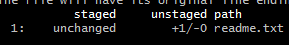
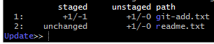

### git add -i 进入互动模式下的8个命令

**Commands**

  1: status       2: update       3: revert       4: add untracked
  
  5: patch        6: diff         7: quit         8: help
  
**命令介绍**
* status
  > 查看版本库、暂存区、工作空间之间的变化

  >sample:

  >根据图示，readme.txt版本库和暂存区之间是一致的，暂存区和工作空间之间有区别

* update
  > 进入如下命令窗口：

  >

  >可以输入指定行号用以选中，输入形式可以是 1 2,3 3-5 7-
  >
  >被选中的行左边会有个 * 号
  >
  >之后输入空命令（直接回车）被选中的文件会被加入暂存区

* revert
  >可以将选中的文件退回到HEAD版本。操作方式类似于update

* add untracked
  >可以将新文件加入到暂存区。操作方式类似于update，revert

* patch
  >选中的文件会依次展示其变更，并提供如下一些命令来使用
  - y - 暂存当前
  - n - 不暂存当前
  - q - 直接退出，之前执行过的命令都无效
  - a - 暂存当前和之后所有
  - d - 不暂存当前和之后所有
  - / - 寻找符合通配的变更文件，会要求输入通配
  - j - 延迟作决定，选择下一个未作决定的变更文件
  - J - 延迟作决定，选择下一个变更文件
  - k - 延迟作决定，选择上一个未作决定的变更文件
  - K - 选择上一个变更文件
  - s - 拆分当前变更为多个更小的变更
  - e - 手工编辑当前变更
  - ? - 打印帮助信息
* diff
  >展示选中文件的变更内容，操作方式类似于update，revert
* help
  >打印帮助信息
* quit
  >退出
